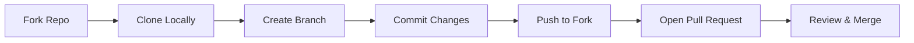

# 🤝 Contributing to Book Lapangan

We love your input! We want to make contributing to **Book Lapangan** as easy and transparent as possible, whether it's:

- 🐛 Reporting a bug
- 📄 Discussing the current state of the code
- 🔧 Submitting a fix
- ✨ Proposing new features

---

## 🛤️ Workflow Overview

We use a standard **Fork & Pull** workflow.



---

## 🚀 Getting Started

1. **Fork** the repo on GitHub.
2. **Clone** the project to your own machine.
3. **Setup** the environment (see [Setup Guide](docs/SETUP.md)).
4. **Create a Branch** with a descriptive name.

   ```bash
   git checkout -b feature/amazing-feature
   # or
   git checkout -b fix/annoying-bug
   ```

---

## ✍️ Coding Guidelines

### 🎨 Style Guide
- **Go**: Always run `gofmt` before committing.
- **Vue/Nuxt**: Use semantically correct HTML and follow Vue best practices.
- **Naming**: Use `camelCase` for JS/Go variables, `kebab-case` for filenames.

### 💬 Commit Messages
We follow the **Conventional Commits** specification.

| Prefix | Description | Example |
| :--- | :--- | :--- |
| `feat` | A new feature | `feat: add payment gateway integration` |
| `fix` | A bug fix | `fix: resolve crash on login` |
| `docs` | Documentation only | `docs: update API reference` |
| `style` | Layout/Style (no code change) | `style: fix button padding` |
| `refactor` | Code restructuring | `refactor: simplify auth middleware` |

---

## 📬 Pull Request Process

1. UPDATE the `README.md` or docs with details of changes if relevant.
2. ENSURE all manual verification steps pass.
3. DESCRIBE your changes clearly in the PR description.
4. LINK to any related issues (e.g., `Closes #123`).

---

## 🐞 Reporting Issues

- Use a clear and descriptive title.
- Describe the exact steps which reproduce the problem.
- Provide logs or screenshots if possible.

**Thank you for helping us build a better platform!** 🏟️
