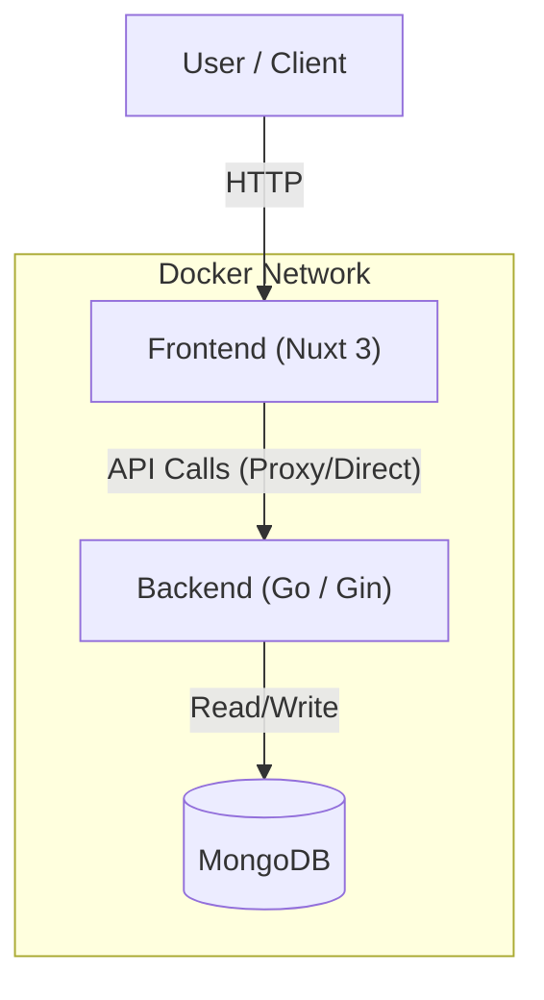

# 🏟️ Book Lapangan Online (Court Line)


A modern fullstack application for booking sports venues online, designed with scalability and containerization in mind.

## 🛠️ Tech Stack & Resources

This project leverages the following technologies:

### Frontend


### Backend


### Database


---

## 🏗️ Architecture

The application is fully containerized using Docker Compose.



## 📂 Project Structure

```bash
book-lapangan/
├── backend/            # Go Backend Service
│   ├── cmd/server/     # Entry point
│   ├── internal/       # Business logic & DB setup
│   ├── go.mod          # Go dependencies
│   └── Dockerfile      # Backend container config
├── frontend/           # Nuxt 3 Frontend
│   ├── app.vue         # Main Vue layout
│   ├── nuxt.config.ts  # Nuxt configuration
│   └── Dockerfile      # Frontend container config
├── docker-compose.yml  # Container orchestration
└── README.md           # Documentation
```

## 🚀 Getting Started

### Prerequisites
- **Docker Desktop** (Required for containerization)
- **Git**

### Installation & Run

1. **Clone the repository**:
   ```bash
   git clone https://github.com/Indra-619/court-line.git
   cd court-line
   ```

2. **Run with Docker Compose**:
   ```bash
   docker-compose up --build
   ```
   *This command builds the Go backend and Nuxt frontend images, and starts the MongoDB container.*

3. **Access the Application**:
   - **Frontend**: [http://localhost:3000](http://localhost:3000)
   - **Backend API**: [http://localhost:8080](http://localhost:8080)

## 📡 API Endpoints

| Method | Endpoint | Description |
|--------|----------|-------------|
| GET    | `/health`| Health check to verify backend status |

## 🧪 Verification

To ensure everything is connected:
1. Open the frontend at `http://localhost:3000`.
2. Click the **"Check Connection"** button.
3. If successful, you will see a green "Backend Status: OK" message, confirming the Nuxt app can communicate with the Go backend inside the Docker network.

---
*Created by [Indra-619](https://github.com/Indra-619)*
