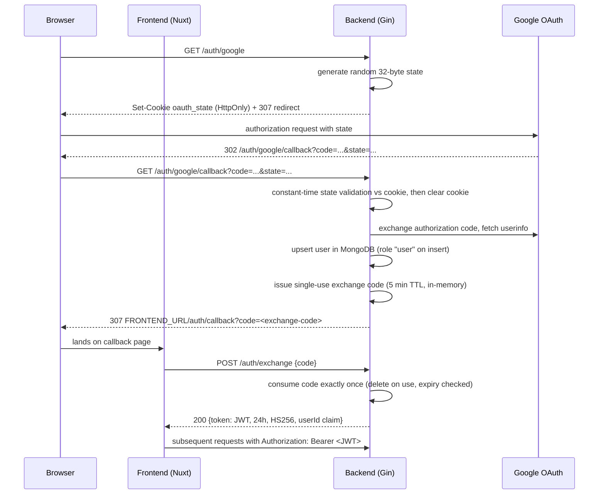

# Architecture

CourtLine is a fullstack court-booking application: a Go/Gin backend, a
Nuxt 3 frontend, and MongoDB, wired together with Docker Compose. This
document describes the layered backend design and the target
dependency-injection shape of the Stage 4 refactor; where the refactor is
still in flight, that is called out explicitly.

## Backend layering

```
cmd/server/main.go
        │  constructs mongo client, config, repositories, handlers
        ▼
internal/handlers ──► internal/domain/repository (interfaces)
                              ▲
                              │ implements
        internal/infrastructure (Mongo repos)
                              │
                    internal/models (BSON structs)
```

- **`internal/handlers`** – HTTP handlers (Gin). They depend only on the
  repository interfaces, never on the Mongo driver directly.
- **`internal/domain/entity`** – pure domain structs (`Court`, `Booking`,
  `User`, `BookingStatus`) with no persistence or JSON tags.
- **`internal/domain/repository`** – the `CourtRepository`,
  `BookingRepository`, and `UserRepository` interfaces, in domain terms.
- **`internal/infrastructure`** – Mongo implementations of those interfaces
  (`MongoCourtRepo`, `MongoBookingRepo`, `MongoUserRepo`), mapping between
  `internal/models` BSON structs (the wire format) and domain entities.
- **`internal/models`** – MongoDB/BSON persistence structs for the
  `booklapangan` database, kept separate from the domain layer.

Shared, dependency-free packages live under `pkg/`:

| Package | Responsibility |
|---|---|
| `pkg/config` | Fail-fast config loading (`MustLoad`, `JWTSecret`) |
| `pkg/validate` | Strict date (`YYYY-MM-DD`) and clock (`HH:MM`) validation, past-date check |
| `pkg/pricing` | Minute-based duration/price calculation and interval overlap detection |
| `pkg/result` | Generic `Result[T]` value-or-error container |

## Dependency injection

In the target design, `cmd/server/main.go` is the composition root: it loads
config, builds the Mongo client, constructs the infrastructure repositories,
injects them into handler structs, and passes the handlers to
`routes.SetupRouter(deps)`. Nothing outside `main` touches the global
environment or a package-level database handle.

> **Status:** handlers currently still reach the Mongo driver through the
> `internal/database` package (`database.Client.Database("booklapangan")`) and
> `routes.SetupRouter()` takes no arguments. The domain entities and
> repository interfaces already exist; the Stage 4 refactor moves handlers
> onto them and removes the global client.

## Authentication flow

Google OAuth with a one-time exchange code instead of a JWT in the URL:



Key properties:

- The OAuth `state` is cryptographically random and compared with
  `crypto/subtle.ConstantTimeCompare`; a missing or mismatched state is a 400.
- The Google access token never reaches the browser; only the short-lived,
  single-use exchange code does.
- `AuthMiddleware` verifies the JWT (HMAC-only) and puts the user's ObjectID
  into the Gin context; `OptionalAuthMiddleware` does the same without
  rejecting anonymous requests.
- `AdminMiddleware` enforces RBAC: it resolves the user's `role` from the
  `users` collection (via an injectable `userRoleLookup`, so it is unit
  testable) and returns 403 unless the role is `admin`. Admin routes:
  `POST/PUT/DELETE /api/courts`.

## Booking flow

`POST /api/bookings` (authenticated):

1. **Validation** (`pkg/validate`): date must be a real `YYYY-MM-DD` calendar
   date and not in the past; start/end must be strict zero-padded `HH:MM`;
   end must be after start. Failures return 400 with a specific message.
2. **Court lookup**: invalid ObjectID → 400, unknown court → 404.
3. **Pricing** (`pkg/pricing.CalculateHours`): exact minute-based duration
   (`(end-start)/60`) multiplied by `pricePerHour` — no whole-hour rounding.
4. **Overlap prevention**: existing `pending`/`confirmed` bookings for the
   same `{courtId, date}` (compound index created at startup) are checked
   with `pricing.Overlaps` using half-open `[start, end)` intervals, so
   back-to-back bookings are allowed. A conflict returns **409** with the
   conflicting slot, which the frontend's BookingForm surfaces to the user.
5. **Insert** with status `pending` → 201.

This is a check-then-insert; on a standalone Mongo without transactions there
is a small race window, an accepted trade-off at this project's scale.

## Data exposure / PII

`GET /api/courts/:id/bookings` is public, so responses are projected into
`BookingPublicView` (id, date, start/end time, status only). Customer name
and phone are never returned to unauthenticated callers. `GET /api/bookings`
returns only the authenticated user's own bookings.

## Security controls

- **JWT fail-fast config**: `config.MustLoad()` runs first in `main`; the
  process exits if `JWT_SECRET` is missing or equals a known insecure default.
- **RBAC**: `AdminMiddleware` gates court writes (see auth flow above).
- **PII redaction**: public booking listings strip customer data.
- **One-time exchange codes**: no JWT or Google token in URLs.
- **Containers**: backend and frontend images are multi-stage, pinned
  (`golang:1.22-alpine`, `alpine:3.20`, `node:20-alpine`, `mongo:7.0`), and
  run as non-root users (`app` / `node`). Mongo has no published host port —
  it is reachable only on the internal `app-network`.
- **Healthchecks**: all three compose services define healthchecks, and
  `backend` waits for `mongo` to be healthy before starting.
- **CORS**: explicit origin allowlist (`localhost:3000`, `frontend:3000`)
  with credentials.

## CI pipeline

GitHub Actions (`.github/workflows/ci.yml`) runs on pushes to `main` and on
all pull requests:

- **backend** job: Go version pinned via `go.mod`; `go vet ./...`,
  `go build ./...`, `go test -race -coverprofile=coverage.out ./...`, then
  uploads the coverage artifact.
- **frontend** job: Node 20, `npm ci`, `npm run build` (Nuxt production
  build).

## Frontend notes

The Nuxt 3 app talks to the backend through `runtimeConfig.public.apiBase`;
auth state lives in the `useAuth` composable (token in `localStorage`, user
fetched from `/auth/me`). The Stage 4 frontend work adds a typed `User`
interface to `useAuth`, disables devtools in production builds, and wires the
409 conflict response into the BookingForm UX.
